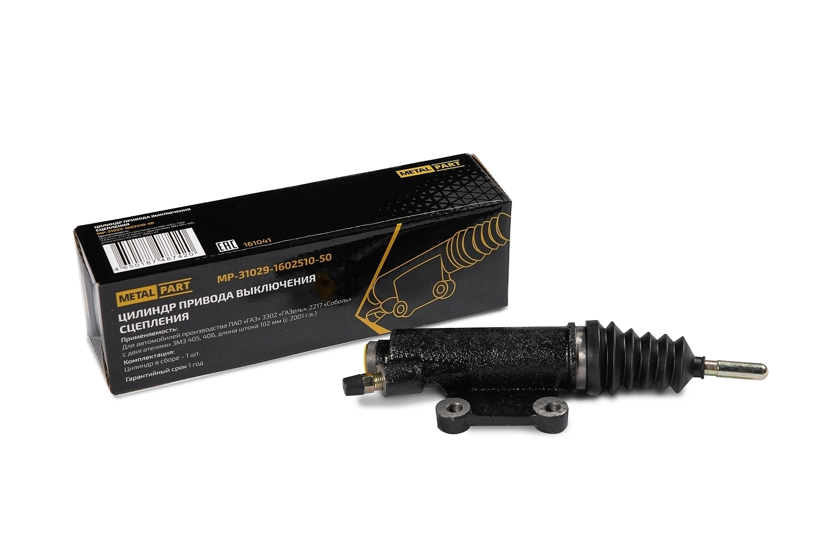

# Цилиндры сцепления — диагностика и замена

> Применимость: ЗМЗ-402, ЗМЗ-405, ЗМЗ-406 (гидравлический привод)
> Модели: Соболь 2217, 2752, 2310 — все

## Конструкция гидропривода сцепления

**Главный цилиндр сцепления (ГЦС)** — у педали в кабине. Создаёт давление при нажатии педали.

**Рабочий цилиндр сцепления (РЦС)** — у картера сцепления, на вилке. Выжимает вилку при давлении.

Жидкость — **DOT-4** (та же, что в тормозной системе).

## Симптомы неисправности

| Симптом | Причина |
|---|---|
| Педаль «проваливается», сцепление не выключается | Износ манжет ГЦС или РЦС |
| Педаль мягкая, нет чёткого усилия | Воздух в системе |
| Течь жидкости у педали | Неисправен ГЦС |
| Течь у картера сцепления | Неисправен РЦС |
| Педаль нажата, но сцепление не выключается | Мала свободный ход — отрегулировать |
| Педаль выжата, диск буксует | Провалилась манжета ГЦС |

## Артикулы

| Деталь | Артикул | Примечание |
|---|---|---|
| Рабочий цилиндр сцепления | **31029-1602510-50** | ЗМЗ-405/406 |
| Главный цилиндр сцепления | уточнять по году | |
| Ремкомплект ГЦС | по году | манжеты + прокладки |

## Замена рабочего цилиндра (РЦС)

### Инструмент

- Ключ 12 мм (болты крепления)
- Ключ 17 мм (штуцер трубки)
- Медная прокладка под штуцер
- Тряпки
- DOT-4

### Порядок

1. Откачать жидкость из бачка ГЦС
2. Ослабить штуцер трубки (ключ **17 мм**) — не откручивать полностью
3. Открутить 2 болта крепления РЦС к картеру (ключ **12 мм**)
4. Выкрутить РЦС из резьбы трубки, придерживая трубку
5. Под штуцером — **медная шайба** (заменить обязательно!)
6. Установить новый РЦС в обратном порядке
7. Затянуть штуцер, болты
8. Залить DOT-4 в бачок ГЦС
9. Прокачать систему

### Прокачка сцепления

Как тормоза, только один штуцер (у РЦС):
1. Надеть шланг на штуцер прокачки РЦС, опустить в бутылку с DOT-4
2. Помощник нажимает педаль несколько раз, удерживает
3. Открыть штуцер на 1 оборот, дождаться выхода пузырьков
4. Закрыть штуцер, отпустить педаль
5. Повторять до выхода чистой жидкости без пузырей
6. Следить за уровнем в бачке ГЦС — не допускать осушения

**Альтернатива «давлением»:** шприцем создать давление в бачке ГЦС — вытеснять жидкость через штуцер. Удобнее без помощника.

## Регулировка педали сцепления

Полный ход педали: **145–160 мм**.
Свободный ход: **5–20 мм** (у толкателя ГЦС).

Регулировка: на толкателе ГЦС (контргайка + зазор). Гидравлика — обязательно прокачать после любой регулировки.

## Нюансы Соболя

- Жидкость в приводе сцепления и тормозах — **одна и та же DOT-4**. Срок службы такой же — менять каждые 2 года.
- При замене РЦС обязательно менять медную прокладку под штуцером — без неё потечёт.
- После монтажа нового РЦС прокачать не менее 2–3 раз: воздух в резьбовом соединении выходит долго.
- ГЦС меняется реже, чем РЦС. Признак: жидкость «уходит» (педаль проваливается после нескольких нажатий) без внешних течей.

## Типичные ошибки

**Не заменить медную шайбу** — штуцер потечёт через неделю.

**Не прокачать после замены** — педаль мягкая, сцепление не выключается.

**Не следить за уровнем при прокачке** — если осушить бачок, воздух попадает в систему и прокачку начинать заново.

**Не проверить ход педали** — слишком мало свободного хода → сцепление не включается до конца → буксует.

## Источники

- [Замена цилиндров сцепления Газели — autoruk.ru](https://autoruk.ru/gaz-2705/transmissiya-gazel/zamena-glavnogo-i-rabochego-tsilindrov-stsepleniya-avtomobilya-gazel)
- [Видео: замена РЦС Газель/Соболь — youtube.com](https://www.youtube.com/watch?v=RnVBTPSpU9Q)

---
*Собрано: 2026-05-26*
