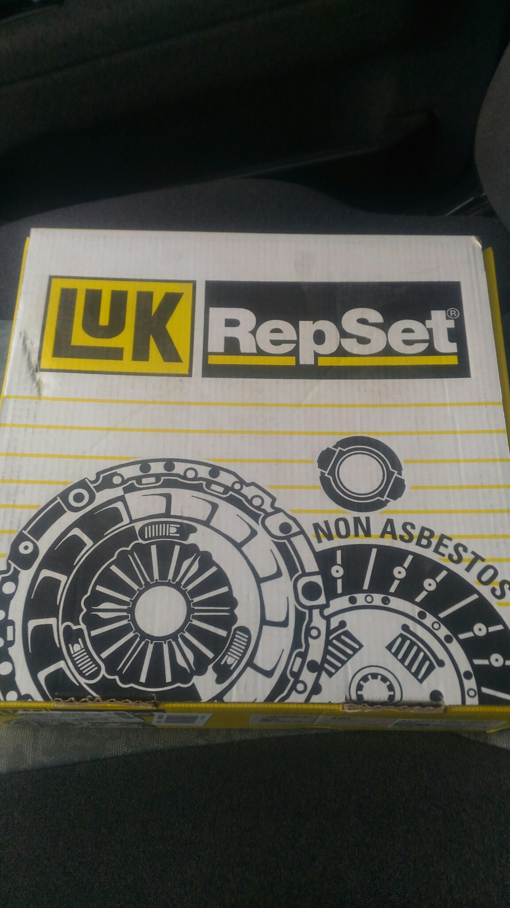
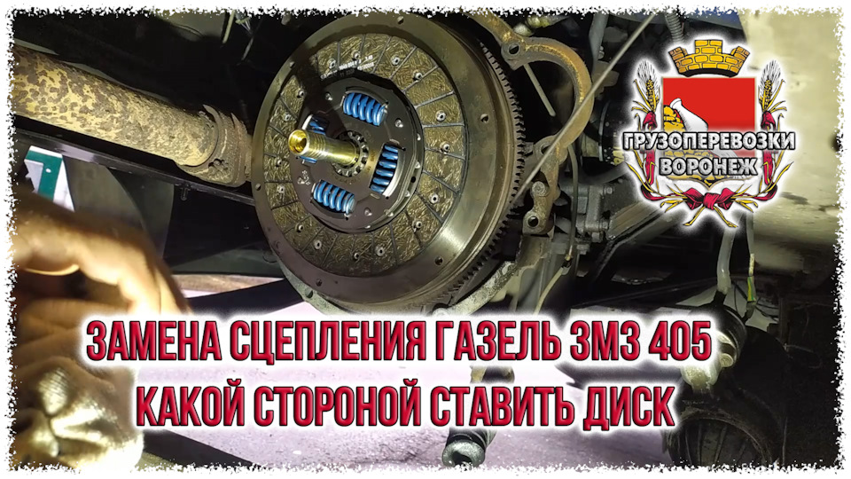

# Замена сцепления — ЗМЗ-405/406 Газель Соболь

> Применимость: ЗМЗ-405, ЗМЗ-406
> Модели: Соболь 2217, 2752, 2310

## Симптомы износа сцепления

- **«Сцепление буксует»**: при нагрузке обороты растут, скорость не увеличивается
- **Запах горелого** после старта в горку или с нагрузкой
- **Рывки при трогании** (диск слиплся или замаслен)
- **Педаль «проваливается»** — проблема гидропривода (не самого диска)
- **Скрежет при включении** сцепления — изношен выжимной подшипник

## Комплект замены

При замене сцепления **менять комплектом**:
1. Диск сцепления (ведомый)
2. Корзина сцепления (нажимной диск)
3. Выжимной подшипник
4. (Опционально) вилка сцепления — при износе
5. (Опционально) подшипник первичного вала КПП — при замене КПП

**Также проверить:** задний сальник коленвала. Если течёт — масло попадёт на диск → сцепление снова буксует. Менять сальник одновременно.

### Артикулы

| Деталь | Производитель | Примечание |
|---|---|---|
| Комплект сцепления (корзина + диск) | **SACHS** (оригинал конвейера) | Рекомендуется |
| Комплект | **LUK** Repset | Хороший аналог |
| Диск отдельно | ГАЗ/ВАЛДАЙ | Оригинал |
| Выжимной подшипник | LUK, SKF | Брать отдельно или в комплекте |

## Порядок замены

### Подготовка

1. Поставить автомобиль на яму или подъёмник
2. Снять кардан (отметить положение относительно фланца — для балансировки)
3. Слить масло из КПП (если планируется снятие)

### Снятие КПП

1. Отсоединить разъёмы (датчик скорости, выключатель заднего хода)
2. Отсоединить шланг гидропривода сцепления от главного цилиндра
3. Снять рычаг переключения передач (болт или защёлки)
4. Поддомкратить КПП снизу (поставить под поддон)
5. Открутить болты крепления траверсы поперечной балки
6. Открутить гайки/болты крепления КПП к колоколу (6–8 болтов)
7. Аккуратно сдвинуть КПП назад — первичный вал выходит из диска сцепления
8. Опустить КПП, вынуть

**Важно:** КПП тяжёлая (~50 кг), нужен помощник или домкрат с плоской деревяшкой.

### Снятие корзины и диска

1. Снять выжимной подшипник с муфтой
2. Поставить метку на корзину и маховик (для балансировки при повторной установке)
3. Откручивать болты корзины **крест-накрест**, постепенно (по пол-оборота), иначе деформация корзины
4. Снять корзину
5. Снять диск сцепления

### Осмотр маховика

Осмотреть поверхность маховика:
- Риски, канавки — расточить на токарном станке
- Трещины — замена маховика
- Если поверхность ровная — оставить

### Установка

1. Протереть маховик обезжиривателем
2. Установить новый диск сцепления надписью **«GEAR BOX SIDE»** к КПП (или «КПП» — к коробке)
3. Выровнять диск по центру маховика оправкой (специальный инструмент или первичный вал от старой КПП)
4. Установить корзину, совместив метки
5. Закрутить болты корзины **крест-накрест**, в несколько проходов до затяжки (момент: 20–25 Нм)
6. Проверить: оправка должна легко выниматься после затяжки корзины — если не вынимается, диск не по центру
7. Смазать шлицы первичного вала тонким слоем Литола (не на накладки диска!)
8. Установить КПП обратно — первичный вал вдвигается в диск сцепления
9. Выровнять КПП по отверстиям болтов, не допуская перекосов
10. Закрутить болты крепления КПП к колоколу
11. Установить траверсу

### Прокачка гидропривода сцепления

После любых работ с гидроприводом сцепления — прокачать систему:
1. Долить жидкость в бачок (DOT-4)
2. Прокачать как тормоза: помощник нажимает педаль, открыть штуцер на рабочем цилиндре, закрыть перед отпусканием педали
3. Повторить до чистой жидкости без пузырей

## Нюансы Соболя

- При замене сцепления **обязательно** проверить задний сальник коленвала. Если масло подтекает — диск замаслится и сцепление заново забуксует за 10–20 тыс. км.
- Некоторые механики снимают КПП с двигателем одновременно — удобнее для доступа к маховику. Но для простой замены диска — КПП отдельно.
- Гидравлический привод сцепления Соболя может вводить в заблуждение: если педаль «проваливается» — проблема в главном или рабочем цилиндре сцепления, а не в самом диске.
- Затяжку болтов корзины обязательно производить крест-накрест — иначе корзина деформируется.

## Типичные ошибки

**Поставить диск не той стороной** — сцепление сразу «ведёт», не включается нормально. Маркировка «GEAR BOX SIDE» к КПП.

**Не центровать диск оправкой** — КПП не встаёт (первичный вал не входит в диск).

**Не заменить задний сальник при наличии течи** — диск в масле, буксует через 20 тыс. км.

**Затянуть болты корзины не крест-накрест** — деформация посадочной поверхности.

**Смазать накладки диска** — они должны быть сухими.

## Инструмент и расходники

- Оправка центровки диска (или старый первичный вал)
- Ключи 10, 12, 14, 17, 19 мм
- Домкрат (под КПП)
- DOT-4 для прокачки гидропривода
- Обезжириватель (протереть маховик)
- Литол-24 (смазка шлицев)

## Источники

- [Замена сцепления ЗМЗ-405 Газель — drive2.ru](https://www.drive2.ru/l/605661033431854468/)
- [Замена на LUK Repset ЗМЗ 405–406 — drive2.ru](https://www.drive2.ru/l/500933925275697214/)
- [Сцепление Газель с ЗМЗ-405/406 — kvatro.biz](https://kvatro.biz/articles/primenyaemost/sceplenie-gazel-s-dvigatelem-zmz-406-i-zmz-405)

---
*Собрано: 2026-05-26*
