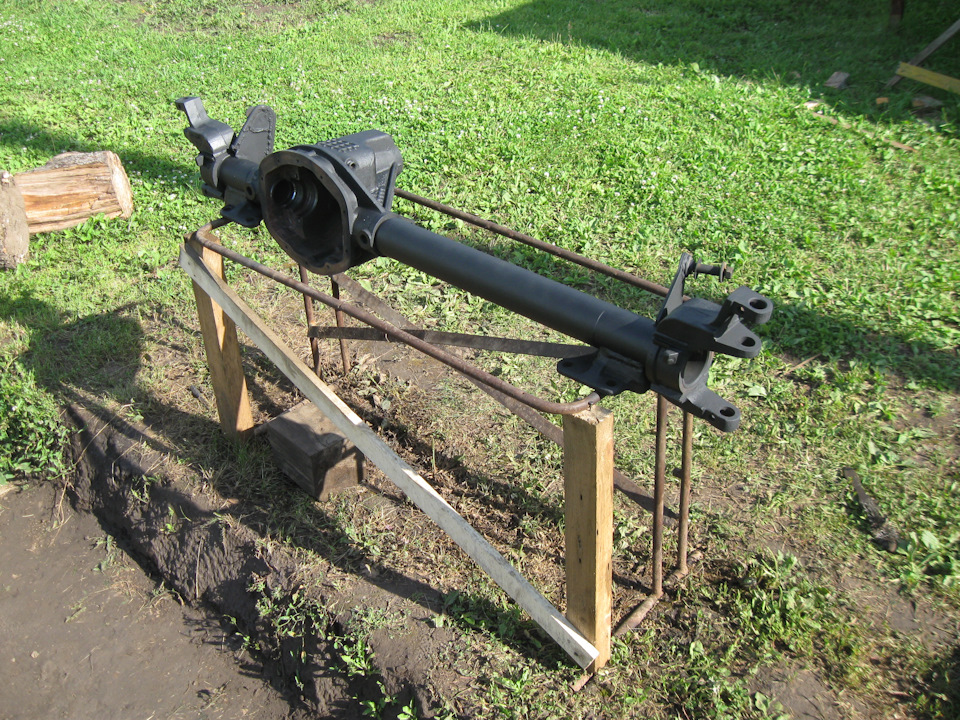

# Передний мост — Соболь 4x4

> Применимость: Соболь 4x4 (полноприводные версии)
> Модели: Соболь 2217 4x4, 2752 4x4

## Конструкция

Передний мост Соболя 4x4 — ведущий, с гипоидным редуктором и шарнирами равных угловых скоростей (ШРУС) или карданными шарнирами на полуосях. Включается через раздаточную коробку (режим 4H или 4L).

## Масло в переднем мосту

| Параметр | Значение |
|---|---|
| Марка масла | GL-5 75W-90 (зима) или 85W-90 (лето) |
| Объём | **2 л** |
| Интервал замены | Каждые 30–40 тыс. км |

**Рекомендации:** Лукойл ТМ-5 SAE 75W-90 (при температуре от −40 до +25°C) или 85W-90 (от −25 до +40°C). Завод рекомендует масла класса «Супер Т-3».

## Замена масла

### Порядок

1. Поднять автомобиль (эстакада или яма)
2. Убедиться что заливная пробка откручивается **до** откручивания сливной
3. Слить горячее (после поездки) масло через сливную пробку
4. Промыть картер при обнаружении металлических частиц (залить немного свежего масла, прокрутить, слить)
5. Закрутить сливную пробку
6. Залить 2 л нового масла через заливное отверстие
7. Уровень — по нижнему краю заливного отверстия
8. Закрутить заливную пробку

### Проверка уровня

На ровной площадке, на холодном мосту:
- Открутить заливную пробку
- Масло должно быть по нижний край отверстия
- При недостатке — долить

## Симптомы неисправности

| Симптом | Вероятная причина |
|---|---|
| Туго включается 4WD | Мало масла, износ шестерён, раздатка |
| Гул при включённом 4WD | Износ подшипников или шестерён редуктора |
| Масло на земле под передком | Течь сальников полуосей или редуктора |
| Хруст при повороте с 4WD | Износ ШРУСов |
| Вибрация при 4WD на скорости | Дисбаланс карданов или износ ШРУСов |

## Нюансы Соболя 4x4

- Передний мост **включается только с остановкой или на малой скорости** (до 10 км/ч) — принудительная блокировка в раздатке.
- **Не использовать 4WD на сухом асфальте** — раздаточная коробка заблокирована, огромные нагрузки на передний мост и раздатку.
- На заводе передний мост часто набит белым герметиком вместо нормального масла — при покупке нового Соболя стоит проверить и заменить масло.
- Заднее загрязнение масла (металлическая пыль, стружка) — признак начала износа редуктора.
- При покупке б/у — обязательно проверить масло в переднем мосту: его часто не меняют вообще.

## Ремонт переднего моста

Типичные причины ремонта:
- Износ ШРУСов (хруст при повороте)
- Разрушение подшипников редуктора
- Износ шестерён редуктора (частое использование 4L на асфальте)

Контрактный мост с разборки — часто дешевле ремонта при серьёзном износе.

## Источники

- [ТО автомобилей Соболь — инструкция по эксплуатации (gazavtomir.ru)](https://gazavtomir.ru/info/teh/exploitation/sobol/9/)
- [Замена масла в трансмиссии Соболь 4x4 — drive2.ru](https://www.drive2.ru/l/10165337/)
- [Ремонт переднего моста Газель/Соболь — remont-gazel.spb.ru](https://remont-gazel.spb.ru/works/remont-perednego-mosta-gazel.html)

---
*Собрано: 2026-05-26*
