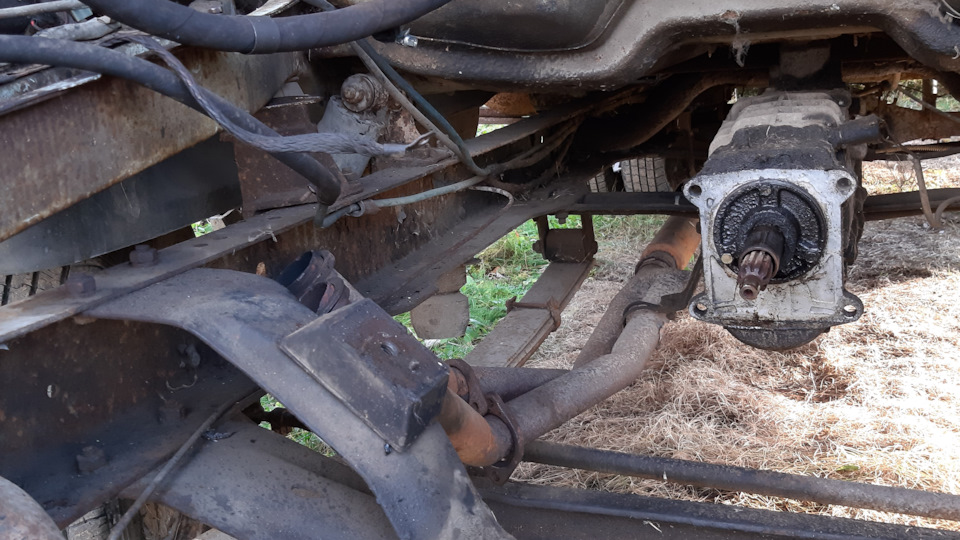

# КПП — диагностика неисправностей

> Применимость: все модели Соболь (5-ступенчатая КПП)
> Модели: Соболь 2217, 2752, 2310 — все

## Симптомы и их причины

| Симптом | Вероятная причина |
|---|---|
| Хруст при включении передачи | Изношены синхронизаторы |
| Гул/вой при движении | Изношены подшипники первичного/вторичного вала |
| Передача «вылетает» сама | Изношены сухари фиксатора или зубья муфты синхронизатора |
| Тугое переключение передач | Мало масла, неисправно сцепление, износ кулисы |
| Течь масла снизу КПП | Износ сальников, трещина картера |
| Хруст только при трогании с места | Чаще это не КПП, а ШРУСы карданного вала |

## Диагностика

### Хруст при переключении передач

Причины в порядке вероятности:
1. **Не до конца выжата педаль сцепления** — самая частая причина. Проверить свободный ход педали.
2. **Недостаток масла или не то масло** — GL-5 убивает синхронизаторы. Проверить уровень и марку.
3. **Изношены синхронизаторы** — зазор в кольцах синхронизатора менее 1 мм.
4. **Изношен первичный вал или его шлицы** — при поднятом капоте слышно.

### Гул/вой КПП

Тест: разгонься до 60 км/ч → перейди на нейтральную передачу (не выключай двигатель) → гул исчез = КПП. Гул продолжается = задний мост или кардан.

### Передача «вылетает»

На какой передаче? Чаще всего вылетает 3-я или 4-я — изношен фиксатор (стальной шарик + пружина). Лечится без полной разборки КПП.

## Масло и интервалы

**Масло:** GL-4 75W-90 или GL-4 80W-90. **GL-5 — запрещено!** (разрушает синхронизаторы из жёлтых металлов).

**Объём:** 1.2 л (не больше — перелив = пена = сальники текут).

**Интервал:**
- Нормальные условия: 60 тыс. км
- Тяжёлые условия (город, грунтовки): 30–40 тыс. км

При покупке б/у Соболя — сразу слить и понюхать масло. Если тёмное, металлическая стружка на пробке — КПП уже изношена.

## Что можно сделать самостоятельно

**Без снятия КПП:**
- Замена масла
- Замена сальников (передний — сальник первичного вала, задний — сальник вторичного вала)
- Замена фиксаторов передач (снять крышку КПП сверху)

**Требует снятия КПП:**
- Замена подшипников
- Замена синхронизаторов
- Ремонт шестерён

## Ремонт или замена?

| Ситуация | Решение |
|---|---|
| Хруст 1–2 передач, остальные OK | Замена синхронизаторов (1.5–3 тыс. руб.) |
| Гул на нейтрали | Замена подшипников (2–5 тыс. руб.) |
| Несколько проблем одновременно | Контрактная КПП (3–10 тыс. руб.) |
| Треснул картер | Только замена |

**Контрактная КПП** с разборки часто выгоднее ремонта изношенной. Перед покупкой — проверить: вращать вал вручную, не должно быть хруста.

## Нюансы Соболя

- Синхронизаторы нового образца (после ~2010 г.) надёжнее старых — при ремонте ставить только их
- Шток выбора передач часто закисает → тугое переключение. Смазать литолом или ТАД-17 (масло для КПП)
- Кулиса КПП (рычаг) разбалтывается — вместо замены отрегулировать тягу или заменить втулку кулисы
- На Соболе с дизельным двигателем — другая КПП, другие моменты затяжки

## Типичные ошибки

**Заливать GL-5 вместо GL-4** — синхронизаторы разрушаются за 20–30 тыс. км.

**Не проверить сцепление** перед диагностикой КПП — неполное выключение = хруст в КПП при исправных синхронизаторах.

**Залить больше 1.2 л** — пена, течь через сальники.

**Покупать дорогостоящий ремонт** без попытки сначала сменить масло — иногда хруст проходит после замены масла (особенно если было GL-5).

## Источники

- [Ремонт КПП Газели — xn--3302-94dx3a.xn--p1ai](https://xn--3302-94dx3a.xn--p1ai/stati/remont-kpp-gazeli-svoimi-rukami/)
- [Неисправности КПП Газель — avtong52.ru](https://avtong52.ru/osnovnie-polomki-kpp-gazel)
- [Синхронизаторы КПП Газели нового образца — litezona.ru](https://litezona.ru/sinhronizator-kpp-gazel-novogo-obrazca/)

---
*Собрано: 2026-05-26*
