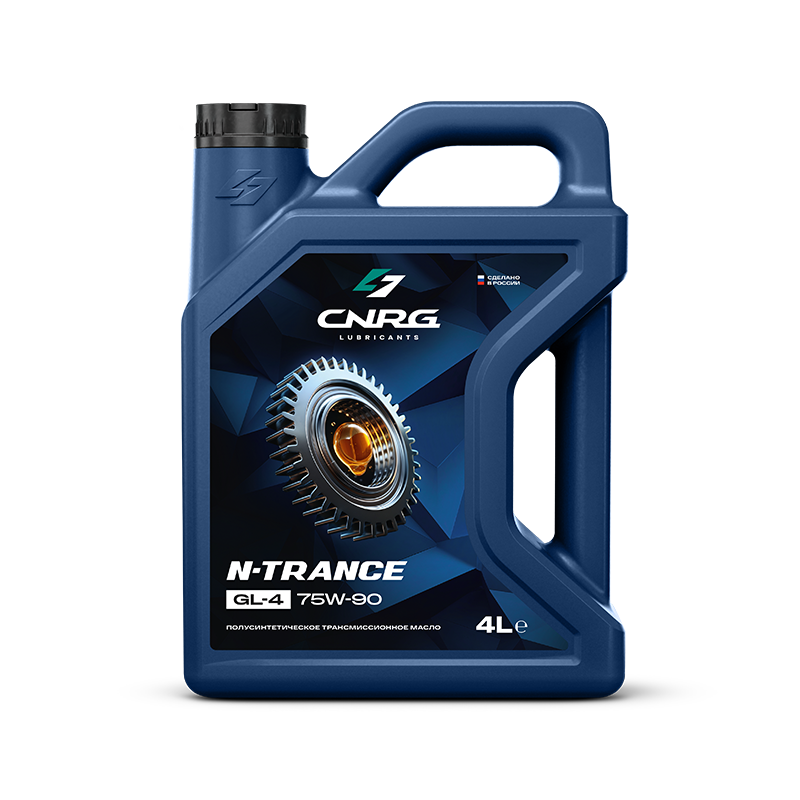

# Масло в КПП, мостах и раздатке

> Применимость: все модели Соболь (4x2 и 4x4)
> Агрегаты: КПП, задний мост, передний мост (4x4), раздатка (4x4)

## Объёмы и рекомендуемые масла

| Агрегат | Объём | Вязкость | Класс | Примечание |
|---|---|---|---|---|
| КПП | **1.2 л** | 75W-85 / 75W-90 | **GL-4** | Не GL-5 — содержит серу, агрессивна к меди |
| Задний мост | **3.0 л** | 80W-90 | **GL-5** | Или ТАД-17 (ТМ-5-18) |
| Передний мост (4x4) | **2.0 л** | 80W-90 | GL-5 | |
| Раздатка (4x4) | **1.65 л** | 80W-90 | GL-5 | |
| **Итого 4x4** | **~8 л** | | | С запасом купить 9–10 л |

**Важно:** в КПП — GL-4, в мосты — GL-5. Разные классы нельзя путать.

## Интервал замены

- По регламенту: каждые **60 тыс. км**
- На практике, особенно б/у авто: каждые **30–40 тыс. км** или если масло тёмное/с металлической стружкой
- При покупке б/у Соболя: сменить всё сразу — неизвестно когда меняли

## Порядок замены (для каждого агрегата)

1. Прогреть агрегат — горячее масло текучее, сливается полностью
2. Подставить ёмкость
3. Открутить сливную пробку (нижняя)
4. Открутить заливную пробку (боковая или верхняя) — **сначала убедись что заливная откручивается**, потом сливай (иначе сольёшь и не зальёшь)
5. Дать стечь 10–15 минут
6. Закрутить сливную пробку
7. Залить новое масло до уровня заливного отверстия (масло должно быть у нижнего края отверстия)
8. Закрутить заливную пробку

Ключ для пробок: обычно **17 мм** или **квадрат 3/8"**.

## Нюансы Соболя

**Металлическая стружка («ёжики») в масле** — норма для задних мостов, особенно при первой замене. Если много крупных частиц — обратить внимание на износ шестерён.

**Завод мог перелить герметик** в пробку — один владелец нашёл пробку заднего моста наполовину заполненную белым герметиком с завода.

**Уровень масла**: у ведущих мостов уровень определяется по заливному отверстию. Залей чуть-чуть больше — потечёт из отверстия, это норма, вытри и закрути пробку.

**Раздатка на 4x4**: у некоторых Соболей слив и заливное отверстие объединены — уточнять по конкретной машине.

## Типичные ошибки

**Залить GL-5 в КПП вместо GL-4** — хуже переключает передачи, долгосрочно — агрессивна к латунным деталям синхронизаторов.

**Забыть проверить откроется ли заливная пробка до слива** — классика. Слил — не можешь залить — едешь искать инструмент с пустым агрегатом.

**Не менять при покупке б/у** — тёмное масло с металлической взвесью показывает состояние узла. После замены и трансмиссия тише, и передачи мягче.

## Инструмент

| Позиция | Что нужно |
|---|---|
| Ключ пробок | 17 мм или вороток 3/8" с квадратом |
| Шприц для масла | Ручной маслозаправщик — удобно заливать в мосты |
| Ёмкость для слива | 4 л минимум (задний мост — 3 л) |

## Источники

- [Замена масел в трансмиссии Соболь 4x4](https://www.drive2.ru/l/10165337/) — drive2.ru (подробный отчёт с объёмами)
- [Замена масла в КПП Соболь](https://www.drive2.ru/l/629716973458031523/) — drive2.ru
- [Замена масла в КПП Газель, Соболь](https://avtokomspb.ru/gaz/tekhnicheskoe-obsluzhivanie/zamena-masla-kpp)

---
*Собрано: 2026-05-26*
