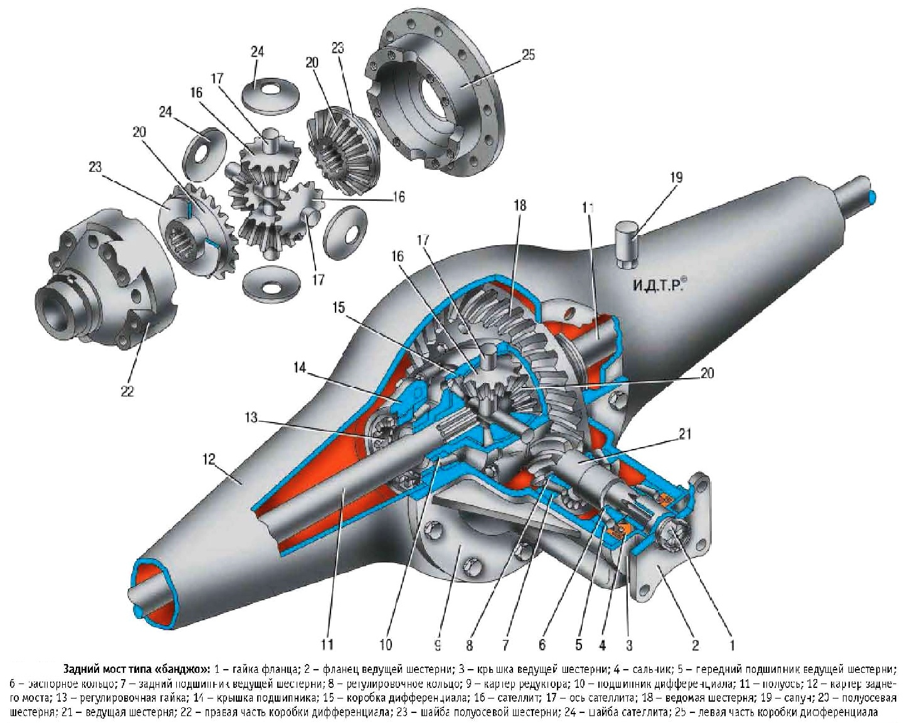

# Задний мост и редуктор — обслуживание и ремонт

> Применимость: все модели Соболь с задним мостом
> Модели: Соболь 2217, 2752, 2310 — все

## Конструкция заднего моста Соболя

Задний мост — **ведущий**, с коническим редуктором главной пары. Передаточное число: 4,11 (стандарт), реже 3,9 (для скоростных версий).

Состав: балка моста + редуктор главной пары + полуоси + ступицы.

## Масло в заднем мосту

| Параметр | Значение |
|---|---|
| Марка масла | GL-5 80W-90 (Газпромнефть, Лукойл, Shell Spirax) |
| Объём | **3 л** |
| Интервал замены | Каждые 48–60 тыс. км |
| При интенсивной эксплуатации | Каждые 30–35 тыс. км |

**Нельзя заливать GL-4** — редуктор с гипоидными шестернями требует GL-5.

### Замена масла в мосту

1. Поднять задний мост
2. Найти заливную пробку (сзади балки или на картере редуктора) — открутить **сначала заливную**, убедиться, что она откручивается
3. Подставить ёмкость, открутить сливную пробку
4. Слить старое масло полностью
5. Завернуть сливную пробку
6. Залить 3 л нового масла через заливное отверстие (шприцем или насосом)
7. Уровень: до нижнего края заливного отверстия
8. Завернуть заливную пробку

## Симптомы неисправности редуктора

| Симптом | Вероятная причина |
|---|---|
| Гул, нарастающий на скорости | Изношены подшипники полуосей или редуктора |
| Вой при разгоне, тише на накате | Износ шестерён главной пары |
| Стук при резком разгоне после наката | Износ зубьев главной пары или мало масла |
| Стук при поворотах | Износ шестерён дифференциала |
| Масло вытекает из-под полуоси | Сальник полуоси |
| Масло вытекает из под фланца кардана | Сальник хвостовика редуктора |

## Диагностика гула моста

Чтобы отличить гул моста от гула колёсного подшипника:
- **Подшипник ступицы:** гул меняется при смене полосы (нагрузка на другое колесо), зависит от угла поворота руля
- **Редуктор:** гул одинаков в обоих направлениях, зависит от скорости и нагрузки, не зависит от угла руля
- **Шина:** исчезает при разгоне на скользком покрытии

### Простой тест

Разогнаться до 60–70 км/ч, перевести в нейтраль (не глушить). Если гул исчез — редуктор (под нагрузкой гудит). Если остался — подшипник ступицы.

## Сальники заднего моста

### Сальник хвостовика редуктора

Масло капает сзади кардана → течёт сальник хвостовика.

1. Снять кардан (4 болта)
2. Зафиксировать фланец хвостовика (трубой через болты)
3. Открутить гайку хвостовика
4. Снять фланец
5. Поддеть и вытащить старый сальник
6. Запрессовать новый (осторожно, ровно)
7. Установить флянец, затянуть гайку (момент: 150–200 Нм)
8. Установить кардан

### Сальники полуосей

Масло капает за барабаном тормоза → течёт сальник полуоси.

1. Снять колесо и тормозной барабан
2. Снять полуось (4 болта фланца)
3. Заменить сальник в балке моста
4. Установить полуось обратно

## Ремонт редуктора

Ремонт редуктора (регулировка подшипников, замена шестерён) требует специального инструмента и навыков. Для самостоятельного ремонта — только при наличии динамометрического ключа и инструмента для регулировки преднатяга подшипников.

**Практика:** при сильном гуле редуктора выгоднее поставить контрактный (с разборки) мост в сборе, чем ремонтировать.

## Нюансы Соболя

- Пробки моста закисают. Перед сменой масла — смочить резьбу WD-40 заранее. Сорванная пробка = большие проблемы.
- Полуосевые подшипники на Соболе с нагрузкой ходят 150–250 тыс. км. После — лёгкий люфт полуоси (влево-вправо) — признак износа.
- При покупке б/у Соболя — заменить масло в мосту сразу (в него могут не заглядывать годами).
- Задний мост Соболя и Газели — одинаковый. Запчасти взаимозаменяемы.

## Типичные ошибки

**Залить GL-4 вместо GL-5** — GL-4 не рассчитан на гипоидные передачи → задиры шестерён.

**Не проверить заливную пробку перед сливом** — если сливная открутилась, а заливная нет → масло слито, но залить невозможно.

**Игнорировать гул редуктора** — разрушение подшипника → задиры шестерён → дорогой ремонт.

## Источники

- [Редуктор заднего моста Газели — gazelleclub.ru](https://www.gazelleclub.ru/manual/transmissiia/zadnii-mostreduktor-gazeli-ego-neispravnosti-i-sposoby-ikh-ustraneniia-r45/)
- [Гул вой редуктора — drive2.ru](https://www.drive2.ru/b/473774888558002631/)
- [Признаки неисправности и ремонт редуктора — remontavtogaz.ru](https://remontavtogaz.ru/polezno/remont-reduktora-zadnego-mosta-gazeli-priznaki-neispravnosti-i-osobennosti-remonta/)

---
*Собрано: 2026-05-26*
