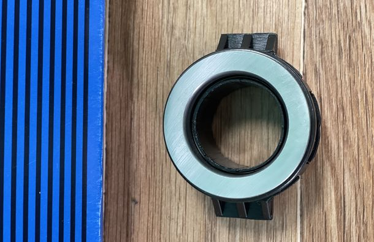

# Выжимной подшипник — диагностика и замена

> Применимость: ЗМЗ-402, ЗМЗ-405, ЗМЗ-406
> Модели: Соболь 2217, 2752, 2310 — все

## Симптомы износа

| Симптом | Пояснение |
|---|---|
| Писк/свист при выжатой педали сцепления | Изношен выжимной подшипник |
| Писк при отпускании педали | Возможно, опорный подшипник первичного вала КПП |
| Хруст при нажатии на педаль | Разрушение сепаратора подшипника |
| Педаль сцепления туго нажимается | Заедает вилка сцепления, недостаточно смазки |

**Диагностика на месте:** завести двигатель, нажать педаль сцепления — появляется шум → выжимной. Отпустить педаль — шум → другие причины (первичный вал КПП, корзина).

## Артикулы

| Деталь | Артикул | Примечание |
|---|---|---|
| Выжимной подшипник в сборе (ГАЗ) | **3110-1601180** | Оригинальный ГАЗ |
| Комплект SACHS Repset | зависит от серии | диск + корзина + выжимной |
| Комплект LUK Repset | зависит от серии | то же |

При пробеге 80–100+ тыс. км менять **комплектом** (диск + корзина + выжимной). Поодиночке менять нерационально — снятие КПП одинаково трудоёмко.

## Порядок замены

### Что нужно проверить до снятия КПП

1. Задний сальник коленвала — если течёт, масло попадёт на новый диск → менять вместе с сальником
2. Состояние вилки сцепления (изношенные ушки — вилка люфтит → плохое выключение)

### Снятие

1. Слить масло из КПП
2. Отсоединить карданный вал (4 болта фланца)
3. Отключить провода и тросики от КПП
4. Открутить крепление КПП к картеру сцепления (ключ 17 мм)
5. Снять КПП
6. Открутить 6 болтов корзины сцепления (ключ **13 мм**), крест-накрест равномерно
7. Снять корзину и диск
8. Снять выжимной подшипник с направляющей

### Установка

1. Смазать вилку сцепления (Литол-24, немного)
2. Смазать направляющую для подшипника (тонкий слой)
3. Надеть новый выжимной подшипник
4. Установить новый диск сцепления (центровать оправкой!)
5. Установить корзину, затянуть 6 болтов (20–25 Нм крест-накрест)
6. Проверить вращение диска — должен быть без биения
7. Установить КПП, не допустив удара по диску при надевании

### Смазка подшипника

Выжимной подшипник — **закрытый** (sealed). Дополнительная смазка не нужна. Некоторые советуют смочить Литолом фетровую прокладку внутри — допустимо.

## Нюансы Соболя

- После замены обязательно проверить регулировку свободного хода педали сцепления (5–20 мм): у гидравлического привода — через прокачку, у тросового — через регулировочную гайку.
- На ЗМЗ-405 с пробегом 100+ тыс. — замена выжимного без замены диска нецелесообразна: трата 2/3 работы.
- Сальник первичного вала КПП (передний) — при открытой КПП стоит посмотреть, не течёт ли. Замена 5 минут при снятой КПП.
- На автомобилях с гидроприводом сцепления — не перепутать с регулировкой. После замены прокачать рабочий цилиндр сцепления.

## Типичные ошибки

**Менять только выжимной без диска** — диск изношен так же, вибрация и пробуксовка вернутся через 10 тыс. км.

**Не центровать диск при установке** — КПП не наденется или наденется с перекосом → биение.

**Перетянуть болты корзины** — деформация; **недотянуть** — прокручивается. Норма 20–25 Нм.

**Не проверить сальник коленвала** — за 2–3 недели масло замочит новый диск.

## Источники

- [Ремонт и замена сцепления Газели — avtomobilgaz.ru](https://avtomobilgaz.ru/furgony/gazel/regulirovka-zamena-scepleniya-gazeli.html)
- [Замена сцепления ЗМЗ-405/406 — gruzoperevoz36.ru](https://gruzoperevoz36.ru/kak-zamenit-sceplenie-gazel/)
- [Выжимной подшипник Газель — rusautoopt.ru](https://rusautoopt.ru/Mufta-stsepleniya-GAZel_Volga_Sobol-v-sbore-(v-upakovke-ORIGINAL)-3110-1601180.html)

---
*Собрано: 2026-05-26*
