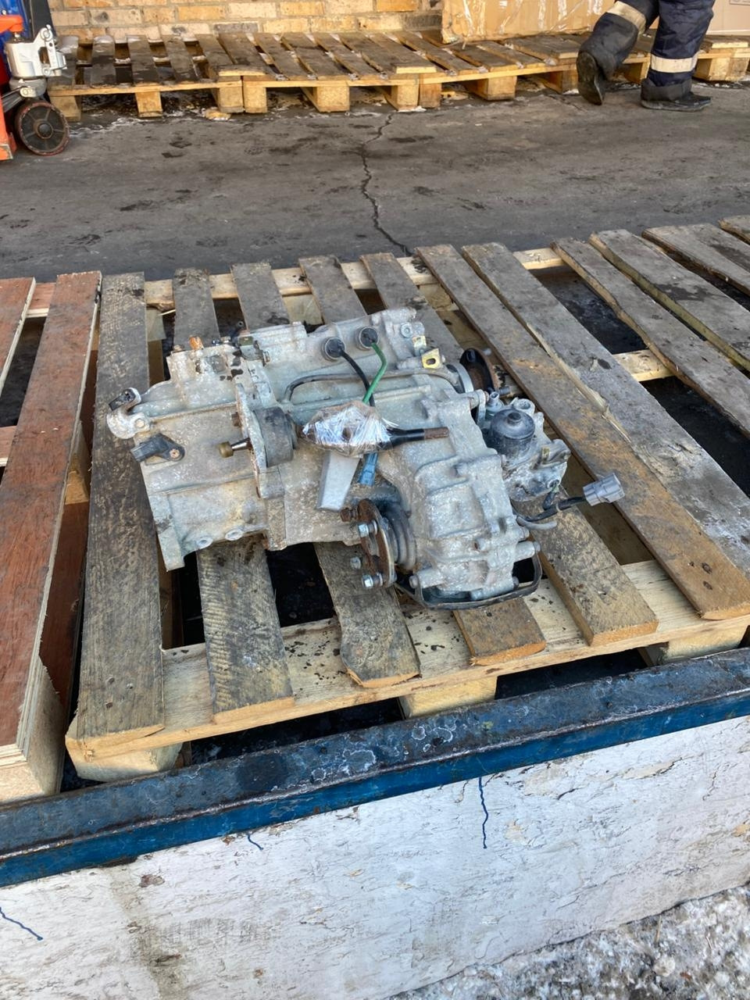

# Раздаточная коробка — не переключается, диагностика и ремонт

> Применимость: все двигатели (только 4x4)
> Модели: Соболь 2217, 2752, 2310 — версии 4x4

## Режимы раздатки Соболя

| Режим | Когда использовать |
|---|---|
| **2H** | Асфальт, нормальные условия |
| **4H** | Скользкая дорога, грунт, снег до 60–80 км/ч |
| **4L** | Тяжёлое бездорожье, подъёмы, из грязи |

**Главное правило:** 4WD на сухом асфальте не использовать — межосевой дифференциал заблокирован, ускоренный износ шин и трансмиссии.

## Типичные неисправности

| Симптом | Причина |
|---|---|
| Рычаг раздатки не доходит до положения | Изношен шток переключения, нет смазки |
| Включается 4WD, но только с большим усилием | Закисли вилки переключения, густая смазка в мороз |
| Не включается 4L (пониженная) | Не нажата педаль сцепления при переключении (обязательно!) |
| Включается, но сразу вылетает | Изношены фиксаторы штоков |
| Гул/дребезг при движении в 4WD | Требует балансировки карданных валов (с завода часто не балансируют) |
| Вибрация в 4WD на асфальте | Разные угловые скорости осей при разблокированном дифференциале — нормально |
| Течёт масло из раздатки | Сальник выходного вала |

## Диагностика проблемы «не переключается»

### Шаг 1 — Масло
Проверить уровень масла в раздатке. Густое или просроченное масло в мороз = тугое переключение. Масло: GL-4 или GL-5 75W-90, **1.65 л**.

### Шаг 2 — Условия переключения
4L переключается только:
- С выжатым сцеплением
- При скорости не выше 5 км/ч (лучше стоя)
- После краткой остановки — «перейти на нейтраль, остановиться, включить 4L»

4H можно включать на ходу до 60 км/ч.

### Шаг 3 — Шток переключения
Снять рычаг или крышку лючка. Осмотреть шток:
- Выработка на штоке в зоне паза фиксатора → шток изношен → замена
- Шарик-фиксатор заклинил → промыть, смазать
- Пружина фиксатора ослабла → замена

### Шаг 4 — Вилки переключения
При разборке раздатки:
- Вилки закисли на штоке → WD-40 + Литол
- Муфта включения задней оси разбита → дефектовка

## Как переключать правильно

**В 4H (на ходу, до 60 км/ч):**
1. Сбросить газ до минимума
2. Перевести рычаг 4WD из 2H в 4H одним уверенным движением
3. Почувствовать щелчок фиксации

**В 4L (только стоя или до 5 км/ч):**
1. Остановиться
2. Нейтраль в основной КПП
3. Выжать сцепление
4. Перевести рычаг из 2H в 4L
5. Включить первую передачу, трогаться

**Выход из 4L:**
1. Остановиться
2. Нейтраль
3. Рычаг в 2H
4. Тронуться

## Ремонт раздатки

Раздаточная коробка Соболя — специфический агрегат, требует навыков. Самостоятельный ремонт возможен, но трудоёмко.

**Что можно сделать самому:**
- Замена масла
- Замена сальника выходного вала
- Замена штока и фиксатора переключения
- Очистка и смазка вилок

**Что требует специалиста или снятия:**
- Замена подшипников
- Замена шестерён или муфт
- Устранение течи через корпус

**Альтернатива — раздатка ГАЗ-66:**
Многие владельцы Соболя 4x4 устанавливают раздаточную коробку от ГАЗ-66. Она прочнее, хорошо знакома специалистам, запчасти доступны.

## Нюансы Соболя 4x4

- С завода карданные валы часто не балансируются → гул и вибрация с первых километров. Сразу балансировать при покупке нового
- Раздатка гудит у многих «с завода» — это особенность, не поломка (жёсткое зацепление шестерён)
- Масло менять каждые 30–40 тыс. км — не реже. Щупа нет, уровень по заливному отверстию
- Пробки раздатки закисают — WD-40 заранее при обслуживании
- На сухом асфальте в 4H: после 10–15 минут появляется хруст при поворотах → переходи в 2H

## Типичные ошибки

**Включать 4L на ходу без нейтрали и выжатого сцепления** — ломает фиксаторы, деформирует вилку.

**Ехать в 4WD на асфальте** — износ резины, трансмиссии, хруст в поворотах.

**Не балансировать карданные валы после снятия/замены** — вибрация уничтожает крестовины и промопору.

## Источники

- [Раздатка ремонт и диагностика — gazelleclub.ru](https://www.gazelleclub.ru/forum/topic/12993-razdatka-remont-i-diagnostika/)
- [Ремонт раздаточной коробки full time — drive2.ru](https://www.drive2.ru/l/548244261351456939/)
- [Размышления о раздатке — drive2.ru](https://www.drive2.ru/l/586505066974843673/)

---
*Собрано: 2026-05-26*
